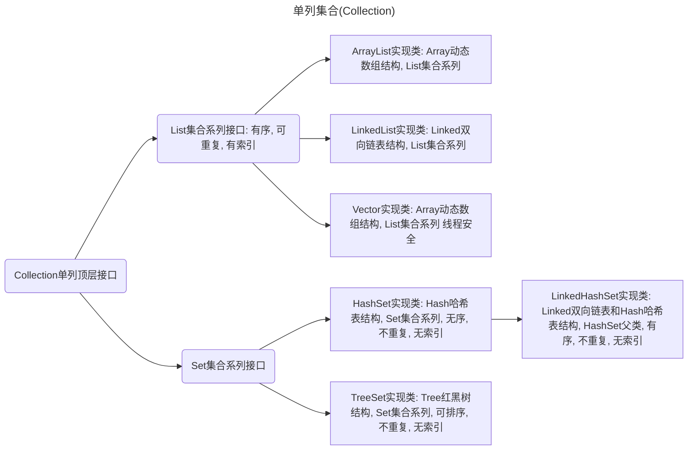
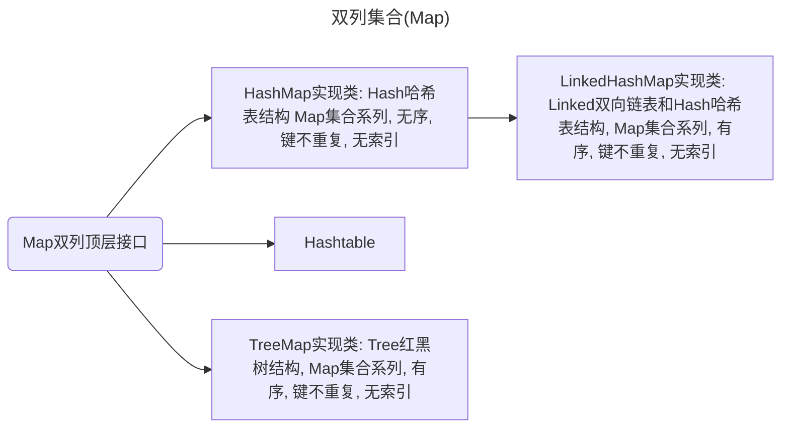

# 集合 - 高阶

> @software: IntelliJ IDEA  
> @author: [Lionel Johnson](https://fairy.host)  
> @contact: [Blog](https://blog.fairy.host/) | [GitHub](https://github.com/FairylandTech) | [Telegram](https://t.me/FairylandFuture)  
> @organization: [GitHub·FairylandFuture](https://github.com/FairylandFuture)  
> @datetime: 2025-08-21 11:13:54 UTC+08:00

         

---

Development Environment
**Please Higher than the version below**

               

---

单列集合(Collection)

双列集合(Map)

- [单列集合顶层接口Collection](src/main/java/org/example/collection/Main.java)
- [单列集合List系列](src/main/java/org/example/list/Main.java)
- [泛型](src/main/java/org/example/generics/Main.java)
- [单列集合Set系列](src/main/java/org/example/set/Main.java)
- [双列集合(Map)](src/main/java/org/example/map/Main.java)
- [可变参数](src/main/java/org/example/args/Main.java)
- [不可变集合](src/main/java/org/example/list/ForzenSet.java)

示例

1. [泛型示例](src/main/java/org/example/generics/demo/Main.java)
2. [TreeSet示例](src/main/java/org/example/set/demo/Main.java)
3. [HashMap示例](src/main/java/org/example/map/demo/demo1/Main.java)
4. [统计投票人数](src/main/java/org/example/map/demo/demo2/Main.java)

